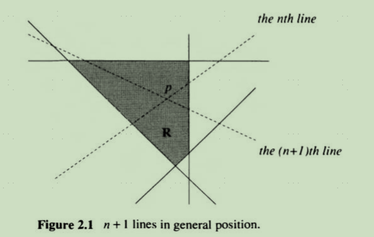



数学归纳法在算法设计中扮演了主要角色。
数学归纳法证明以下两点：
1. T在n=1成立
2. 对于所有的n>1,如果T在n-1成立，那么T在n成立 (使用n和n+1也是一样的)
   
第2点被称为归纳假设(induction hypothesis)。证明条件2比直接证明命题要容易，因为我们已经假设n-1时T成立。从某种意义上，我们“免费”得到了归纳假设。

以下是一些使用数学归纳法的例子。

## 2.3 平面中的区域计数

**一般位置 general position** 任意两条线不平行且任意三条线不交于一点。

猜想：在一般位置的n条线上添加一条线，区域数目增加n+1。

证明：
移去第n条线，那么第n+1条线变成第n条线。根据假设，区域增加了n个。现在把第n条线加回来。则交点p所在的区域变成了4个，而不是3个，所以又多增加了1个区域，所以是n+1。

