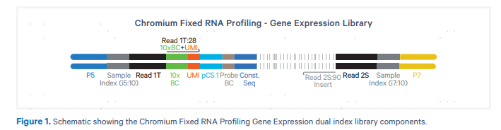
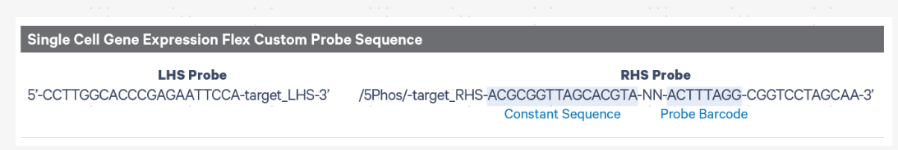
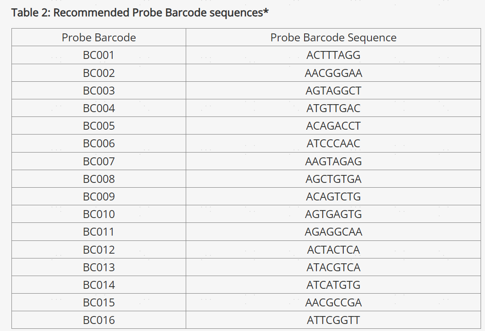

# Chromium Single Cell Gene Expression Flex

R1 28bp: 16bp cell barcode + 12bp UMI

R2 90bp: ligated probe insert sequence, constant sequence,
and the 8 bp Probe Barcode that identifies the probe set used to hybridize the sample

Each Probe Barcode ID (e.g., BC001) is actually a mix of four distinct barcode sequences, which ensures balanced base composition during sequencing. These corrected sequences are then collapsed such that the Probe Barcode sequence used within the cell barcode is always lexicographically the first barcode amongst the four barcodes from a given mixture. For example, if the four Probe Barcodes are ACTTTAGG, CGAGGGTA, GACACTAC, and TTGCACCT, all instances of these Probe Barcodes will be converted to ACTTTAGG

- [What is Fixed RNA Profiling?](https://support.10xgenomics.com/single-cell-gene-expression/software/pipelines/latest/what-is-frp)

- [Fixed RNA Profiling Algorithms Overview](https://support.10xgenomics.com/single-cell-gene-expression/software/pipelines/latest/algorithms/frp)

- [TECHNICAL NOTE](https://cdn.10xgenomics.com/image/upload/v1695231942/support-documents/CG000677_Flex_Gene_Expression_SeqMetrics_BaseComposition_Rev_B.pdf)

- [Fixed RNA Profiling Probe Sets Overview](https://www.10xgenomics.com/support/single-cell-gene-expression-flex/documentation/steps/probe-sets/chromium-frp-probe-sets-overview)

- [How do I design custom probes for a Single Cell Gene Expression Flex (i.e., Fixed RNA Profiling) for multiplexed samples experiment?](https://kb.10xgenomics.com/hc/en-us/articles/17623693026445-How-do-I-design-custom-probes-for-a-Single-Cell-Gene-Expression-Flex-i-e-Fixed-RNA-Profiling-for-multiplexed-samples-experiment)

- [Genentech preprint](https://www.biorxiv.org/content/10.1101/2024.06.18.599579v1.full.pdf)
