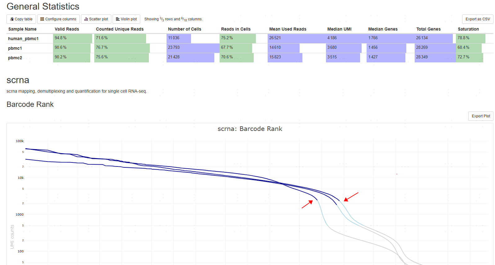

# Two cell calling algorithms

CeleScope(like CellRanger and Starsolo) implements two [Cell filtering (calling) algorithms](https://github.com/alexdobin/STAR/blob/master/docs/STARsolo.md#cell-filtering-calling): knee filtering and EmptyDrop-like filtering. The default cell-calling method of CeleScope is EmptyDrop-like filtering(EmptyDrops_CR).

Knee filtering is a "stable" cell-calling algorithm: the number of cells will not increase with the increase of sequencing depth, because knee filtering considers UMI counts exceed a **dynamic threshold** m/10, where m is the 99th percentile of top N barcodes based on total UMI counts. 

In contrast, EmptyDrop-like is not that "stable". One reason is that in the second step, only cells above a **hard threshold** `umiMin` (default 500) are taken into consideration; as the sequencing depth increases, more and more cells will be taken into consideration. A more detailed description of the two algorithms can be found in the following links.

[Cellranger EmptyDrops](https://www.10xgenomics.com/support/software/cell-ranger/latest/algorithms-overview/cr-gex-algorithm)

[soloCellFilter identical results between EmptyDrops_CR and CellRanger2.2
](https://github.com/alexdobin/STAR/issues/1339)

[STARsolo --EmptyDrops_CR parameters](https://www.biostars.org/p/9477173/)

Verification on the pbmc1 sample：

|sample|cell number: knee filtering|cell number: EmptyDrop-like filtering|
|--|--|--|
|pbmc1 all reads|17255|23793|
|pbmc1 subsample 10% reads|17427|17868|

BD also has two cell-calling algorithms: basic and refine. Basic is similar to knee filtering, and refine is similar to EmptyDrop-like filtering.
The Genentech preprint uses [v2.0 BD Rhapsody™ Sequence Analysis Pipeline](https://scomix.bd.com/hc/en-us/articles/360047408451-BD-Rhapsody-Analysis-Pipeline-Updates), which just changed the default algorithm from refine to basic.

> Basic cell caller is now the default algorithm. Refined cell calling algorithm can still be used by setting the Enable_Refined_Cell_Call parameter

## What kind of samples are “unstabler”?

Samples without a sharp knee are ”unstabler“ because the absence of a sharp knee indicates a higher background, making it easier for the EmptyDrops algorithm to mistakenly identify the background as real cells.