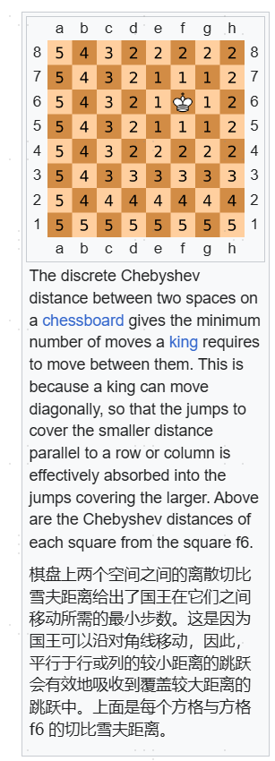

# 曼哈顿距离 切比雪夫距离

曼哈顿：坐标差绝对值之和
https://en.wikipedia.org/wiki/Taxicab_geometry

切比雪夫距离：坐标差绝对值的最大值
https://en.wikipedia.org/wiki/Chebyshev_distance

## [3102\. 最小化曼哈顿距离](https://leetcode.cn/problems/minimize-manhattan-distances/)