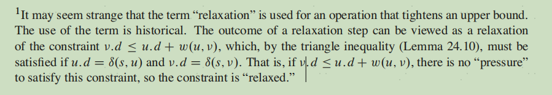
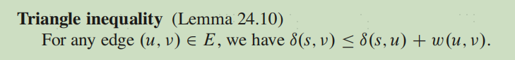

# 最短路径 dijkstra

思路：BFS弹出的元素是剩下节点中到起点距离值最小的节点x，然后遍历x的出边，进行松弛操作。
松弛：如果x到起点距离 加上 x到y的距离 < y到起点距离, 那么更新y到起点的距离。 虽然y到起点的距离变短了，收紧了上界，但这个操作使得没有压力去满足三角不等式了，所以叫做松弛。
三角不等式：




稀疏图用优先队列邻接表，稠密图可以用暴力遍历邻接矩阵。优先队列复杂度O((n+m)logn)，暴力邻接矩阵 O(n*n)。是稠密图时，m~=n*n, 暴力邻接矩阵比优先队列好。

优先队列复杂度：检查每个点每条边，每次需要logn来得到当前距离最短的节点
```py
        # Dijkstra 算法
        dis = [inf] * n 
        dis[0] = 0
        hq = [(0,0)]
        while hq:
            d,x = heappop(hq)
            # if x == 终点: return d
            if d > dis[x]: # 出过堆，也可以用一个vis数组判断
                continue
            for y,dy in g[x]:
                if d + dy < dis[y]:
                    dis[y] = d + dy
                    heappush(hq, (dis[y],y))
```

也可以用done数组判定是否完成了节点出边的遍历
```py
        # Dijkstra 算法
        dis = [inf] * n
        done = [False] * n
        dis[0] = 0
        hq = [(0,0)]
        while hq:
            d,x = heappop(hq)
            # if x == 终点: return d
            if done[x]: continue
            for y,dy in g[x]:
                if d + dy < dis[y]:
                    dis[y] = d + dy
                    heappush(hq, (dis[y],y))
            done[x] = True
```

# Floyd最短路径算法

# 链接

- [两种 Dijkstra 写法（附题单）Python/Java/C++/Go/JS/Rust](https://leetcode.cn/problems/network-delay-time/solutions/2668220/liang-chong-dijkstra-xie-fa-fu-ti-dan-py-ooe8/)

## [1976\. 到达目的地的方案数](https://leetcode.cn/problems/number-of-ways-to-arrive-at-destination/)

```py
MOD = 10**9+7
class Solution:
    def countPaths(self, n: int, roads: List[List[int]]) -> int:
        g = defaultdict(list)
        for x,y,t in roads:
            g[x].append((t,y))
            g[y].append((t,x))

        hq = [(0,0)]
        dis = [inf] * n
        dis[0] = 0
        cnt = [0] * n
        cnt[0] = 1
        while hq:
            d, x = heappop(hq)
            if x == n-1: 
                break
            if d > dis[x]: #堆中可能有多个x; 如果d>dis[x]说明x已经出过堆
                continue
            for t,y in g[x]:
                if d + t < dis[y]:
                    dis[y] = d + t
                    cnt[y] = cnt[x]
                    heappush(hq, (dis[y],y)) 
                elif d + t == dis[y]:
                    cnt[y] = (cnt[y] + cnt[x]) % MOD

        return cnt[n-1]
```

暴力写法
```py
MOD = 10**9+7
class Solution:
    def countPaths(self, n: int, roads: List[List[int]]) -> int:
        g = defaultdict(list)
        for x,y,w in roads:
            g[x].append([y,w])
            g[y].append([x,w])
        
        dis = [inf]*n
        dis[0] = 0
        #S = set()
        Q = set(range(n))
        cnt = [0]*n
        cnt[0] = 1

        while Q:
            _, x = min((dis[i], i) for i in Q)
            Q.remove(x)
            #S.add(x)
            for y,w in g[x]:
                if dis[y] > dis[x] + w:
                    dis[y] = dis[x] + w
                    cnt[y] = cnt[x]
                elif dis[y] == dis[x] + w:
                    cnt[y] += cnt[x]
        return cnt[n-1] % MOD
```

## [2065\. 最大化一张图中的路径价值](https://leetcode.cn/problems/maximum-path-quality-of-a-graph/)

用最短路剪枝，比暴搜快
```py
class Solution:
    def maximalPathQuality(self, values: List[int], edges: List[List[int]], maxTime: int) -> int:
        n = len(values)
        g = [[] for _ in range(n)]
        for x, y, t in edges:
            g[x].append((y, t))
            g[y].append((x, t))

        # Dijkstra 算法
        dis = [inf] * n 
        dis[0] = 0
        hq = [(0,0)]
        while hq:
            d,x = heappop(hq)
            if d > dis[x]:
                continue
            for y,dy in g[x]:
                if d + dy < dis[y]:
                    dis[y] = d + dy
                    heappush(hq, (dis[y],y))

        self.ans = 0
        vis = [False] * n
        def dfs(x, maxTime, v):
            visited = vis[x] #保留现场
            if not visited:
                v += values[x]
                vis[x] = True
            if x==0:
                self.ans = max(self.ans, v)
            for y,t in g[x]:
                if maxTime >= t + dis[y]:
                    dfs(y, maxTime-t, v)
            vis[x] = visited #恢复现场

        dfs(0, maxTime, 0)
        return self.ans
```

## [2577\. 在网格图中访问一个格子的最少时间](https://leetcode.cn/problems/minimum-time-to-visit-a-cell-in-a-grid/)


给你一个 `m x n` 的矩阵 `grid` ，每个元素都为 **非负** 整数，其中 `grid[row][col]` 表示可以访问格子 `(row, col)` 的 **最早** 时间。也就是说当你访问格子 `(row, col)` 时，最少已经经过的时间为 `grid[row][col]` 。

你从 **最左上角** 出发，出发时刻为 `0` ，你必须一直移动到上下左右相邻四个格子中的 **任意** 一个格子（即不能停留在格子上）。每次移动都需要花费 1 单位时间。

请你返回 **最早** 到达右下角格子的时间，如果你无法到达右下角的格子，请你返回 `-1` 。

思路：
1. 只要能走第一步，后面的节点都可以通过“反复横跳”到达。
2. 由于反复横跳，（x,y)到起点的最短距离的奇偶性需要和x+y保持一致。

```py
class Solution:
    def minimumTime(self, grid: List[List[int]]) -> int:
        if grid[0][1] > 1 and grid[1][0] > 1:
            return -1
        m,n = len(grid),len(grid[0])
        dis = [[inf] * n for _ in range(m)]
        #done = [[False] * n for _ in range(m)]
        dis[0][0] = 0
        hq = [(0,0,0)]

        DX = [0,0,1,-1]
        DY = [1,-1,0,0]
        def neighbor(x,y):
            for dx,dy in zip(DX,DY):
                nx = x+dx
                ny = y+dy
                if 0<=nx<m and 0<=ny<n:
                    yield (nx,ny)

        for x in range(m):
            for y in range(n):
                if grid[x][y] % 2 != (x+y) % 2:
                    grid[x][y] += 1

        while hq:
            d,x,y = heappop(hq)
            if (x,y) == (m-1,n-1): return d #到了终点
            if d > dis[x][y]: continue
            for nx,ny in neighbor(x,y):
                if d + 1 < dis[nx][ny]:
                    dis[nx][ny] = max(d+1, grid[nx][ny])
                    heappush(hq, (dis[nx][ny],nx,ny))
```