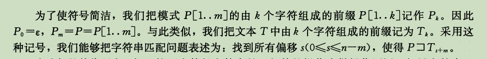
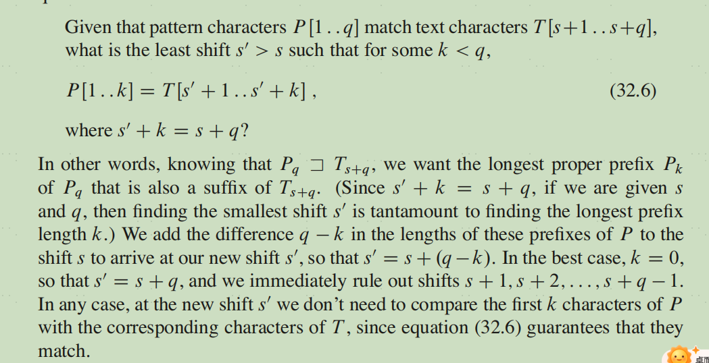

# KMP

算法4

> For every character c, dfa[c][j] is the pattern position to compare against the next text position after comparing c with pat.charAt(j).

对于每个字符c, dfa[c][j]表示的是，在c和pat[j]比较之后，应该与下一个文本字符比较的pat位置。
dfs[c][j] = next pat index

> For a match, we want to just move on to the 
next character, so dfa[pat.charAt(j)][j] is 
always j+1.

如果匹配上了，我们希望移动到下一个字符，所以dfs[pat[j]][j]等于j+1

> For a mismatch, we know not just txt.charAt(i), but also the j-1 previous characters in the text: they are the first j-1 characters in the pattern.

如果没匹配上，我们不仅知道txt[i], 也知道前j-1个txt中的字符：他们是pat中前j-1个字符。

> For each character c, imagine that we slide a copy of the pattern over these j characters (the first j-1 characters in the pattern followed by c—we are deciding what to do when these characters are txt.charAt(i-j+1..i)), from left to right, stopping when all overlapping characters match (or there are none). 

> This gives the next possible place the pattern 
could match. The index of the pattern character to compare with txt.charAt(i+1) (dfa[txt.charAt(i)][j]) is precisely the number of overlapping characters.

## 算法导论 CLRS

符号和术语
T,P,偏移


前缀和后缀


找到所有偏移s, 使得P是T[1..s+m]的后缀





## 笔记

KMP 算法思想：在失配时，利用已经匹配的字符串，达到文本T的指针不会减少，只会减小模式P的指针，从而减少匹配次数。

前缀表：next,fail,LPS(longest proper prefix which is also suffix)
fail[i]: p[0..i]的最长相等前后缀的长度。在失配后，可以跳过最长相等的前缀，因为前缀和已经匹配的后缀相等。

如何快速推导出fail数组：利用动态规划的思想，实际上也是KMP匹配的过程。

# 模板

```py
class Solution:
    def strStr(self, haystack: str, needle: str) -> int:

        def get_fail(p: str) -> List[int]:
            n = len(p)
            fail = [0] * n
            j = 0
            for i in range(1,n):
                while j>0 and p[i] != p[j]:
                    j = fail[j-1]
                if p[i] == p[j]:
                    j += 1
                fail[i] = j
            return fail
        
        n = len(haystack)
        fail = get_fail(needle)
        j = 0
        for i in range(n):
            while j > 0 and haystack[i] != needle[j]:
                j = fail[j-1]
            if haystack[i] == needle[j]:
                j += 1
            if j == len(needle):
                return i-j+1
        return -1
```

# 题目

## [28\. 找出字符串中第一个匹配项的下标](https://leetcode.cn/problems/find-the-index-of-the-first-occurrence-in-a-string/)