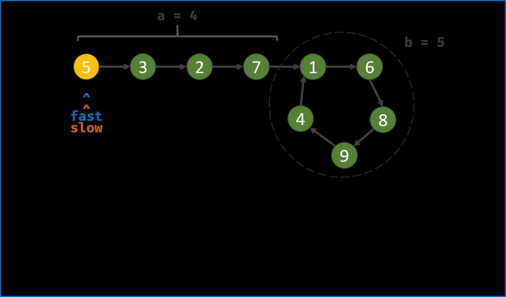

# 题目

## [148\. 排序链表](https://leetcode.cn/problems/sort-list/)

难点在于记得截断链表。判断链表中点也可以用快慢指针。

```py
def merge(x1,x2):
    dummy = ListNode()
    p = dummy
    while x1 and x2:
        if x1.val < x2.val:
            p.next = x1
            x1 = x1.next
        else:
            p.next = x2
            x2 = x2.next
        p = p.next
    if x1:
        p.next = x1
    else:
        p.next = x2
    return dummy.next

def mergesort(x, n):
    if n<=1: return x
    h = n // 2
    x1 = p = x
    for _ in range(h-1):
        p = p.next
    x2 = p.next
    p.next = None #截断链表
    x1 = mergesort(x1,h)
    x2 = mergesort(x2, n-h)
    return merge(x1,x2)

class Solution:
    def sortList(self, head: Optional[ListNode]) -> Optional[ListNode]:
        n = 0
        p = head
        while p:
            n += 1
            p = p.next
        root = mergesort(head, n)
        return root
```

## [142\. 环形链表 II](https://leetcode.cn/problems/linked-list-cycle-ii/)


设相遇时，快指针走了f步，慢指针走了s步，那么
```
f = 2s
f = s + nb
```
所以s=nb

此时需要s再走a步，就可以到达环入口。那么用一个指针从头开始一起走。

```py
class Solution:
    def detectCycle(self, head: Optional[ListNode]) -> Optional[ListNode]:
        fast = slow = head
        while True:
            if not (fast and fast.next): # 写成fast.next and fast.next.next的话，无法处理head为空
                return None
            fast = fast.next.next
            slow = slow.next
            if fast == slow:
                break
        
        p = head
        while p != slow:
            p = p.next
            slow = slow.next
        return p
```

## [19\. 删除链表的倒数第 N 个结点](https://leetcode.cn/problems/remove-nth-node-from-end-of-list/)

快慢指针经典。慢指针走到倒数n+1个节点。由于head可能被删除，使用dummy简化代码。

```py
class Solution:
    def removeNthFromEnd(self, head: Optional[ListNode], n: int) -> Optional[ListNode]:
        slow = fast = dummy = ListNode(next = head)
        for _ in range(n):
            fast = fast.next
        while fast.next:
            fast = fast.next
            slow = slow.next
        slow.next = slow.next.next
        return dummy.next
```